# Introduction

## Preparation

Welcome to Chippy! This discussion is a guided tour: every open task explains one feature and shows where to find it on a screenshot. Work top to bottom — the numbering starts with the essentials (high priority), then the important features (medium), then the rest (low). Set each task to DONE as you master it; your progress shows up on the Kanban board and the Activity page, which is itself a first exercise.

## Entries

### 2026-08-25 09:00:00 | tags: task, low

46 — Slim mode (narrow windows). Below 800px width Chippy switches to three tabs — Navigation, Discussion, Tasks & Goals — showing one column at a time. Same features, phone-sized layout.

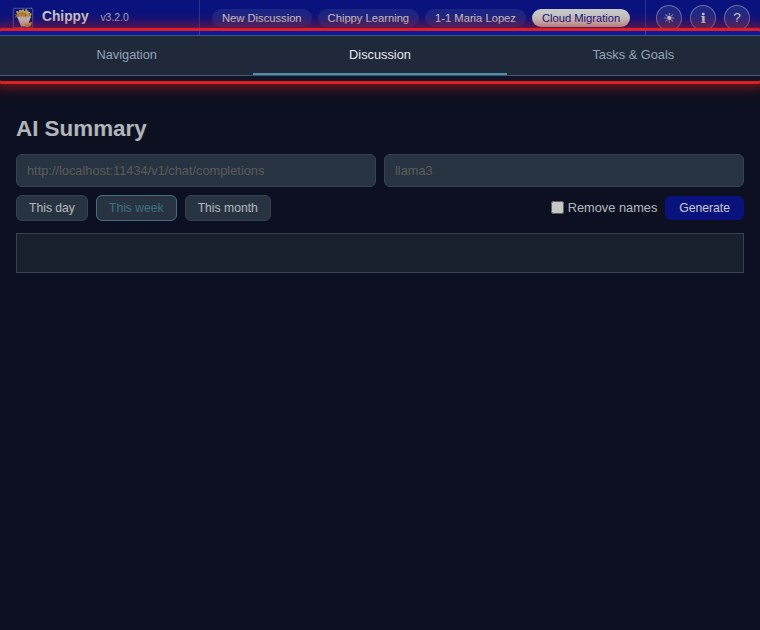

### 2026-08-25 09:01:00 | tags: task, low

45 — Help & About. ? opens the full help — everything this introduction covers and more, including the Markdown syntax and all chips and badges. ℹ shows version and license info.

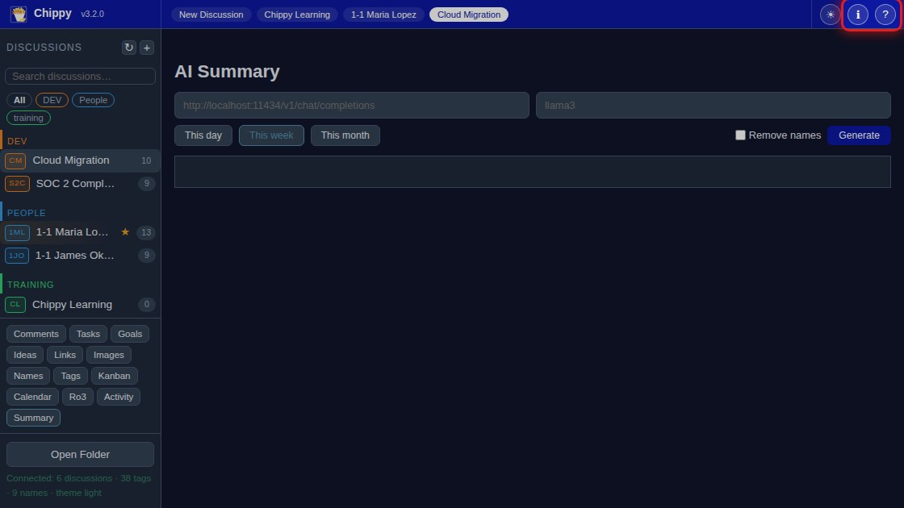

### 2026-08-25 09:02:00 | tags: task, low

44 — Print. 🖶 prints the current screen — on a discussion it prints the raw stored Markdown, so what’s on paper is exactly what’s in the file.

### 2026-08-25 09:03:00 | tags: task, low

43 — Light & dark theme. The ☀ button in the top bar toggles light and dark; the choice is saved with your data folder, so it follows the notebook.

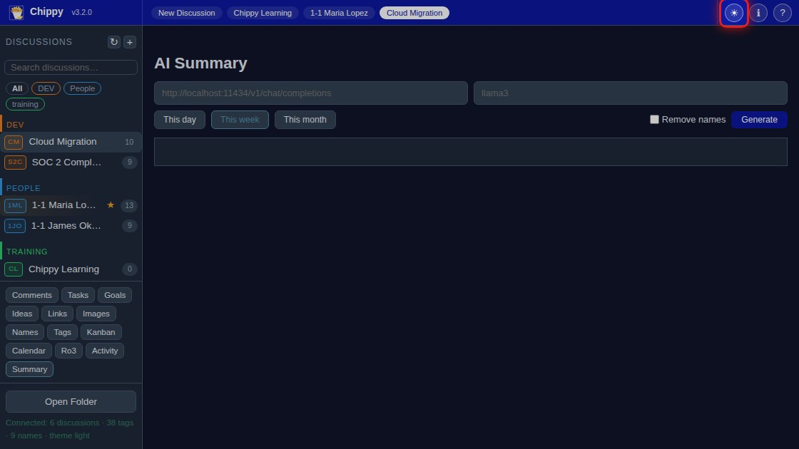

### 2026-08-25 09:04:00 | tags: task, low

42 — Archive a discussion. 🗄 archives the discussion: its file is renamed to *.archive.md and it leaves the sidebar. Nothing is deleted — restore it any time by renaming the file back.

### 2026-08-25 09:05:00 | tags: task, low

41 — Export a contribution summary. ⬇ exports the discussion as a Markdown contribution summary, grouped by day with visible tags — great raw material for mid-year and end-year reviews.

### 2026-08-25 09:06:00 | tags: task, low

40 — Reload from disk. ↻ re-reads the discussion’s file from disk — handy when something else edited it (a sync client, a script, another tool).

### 2026-08-25 09:07:00 | tags: task, low

39 — Rename a discussion. The ✎ next to the title renames the discussion in place — the file, the image subfolder and all references follow automatically.

### 2026-08-25 09:08:00 | tags: task, low

38 — Delete a comment. 🗑 (set slightly apart so you don’t hit it by accident) deletes a comment and its images after a confirmation. Tasks rarely need deleting — set them DONE or OBSL instead and history stays complete.

### 2026-08-25 09:09:00 | tags: task, low

37 — Move a comment. ➜ moves a comment to another discussion — its images move along and a "Moved from" marker keeps the trail.

### 2026-08-25 09:10:00 | tags: task, low

36 — The Activity dashboard. Charts over your notebook: comment inflow, task/goal/idea state distributions, a monthly timeline, an open-task burndown and per-day task creation. Useful for spotting overload early.

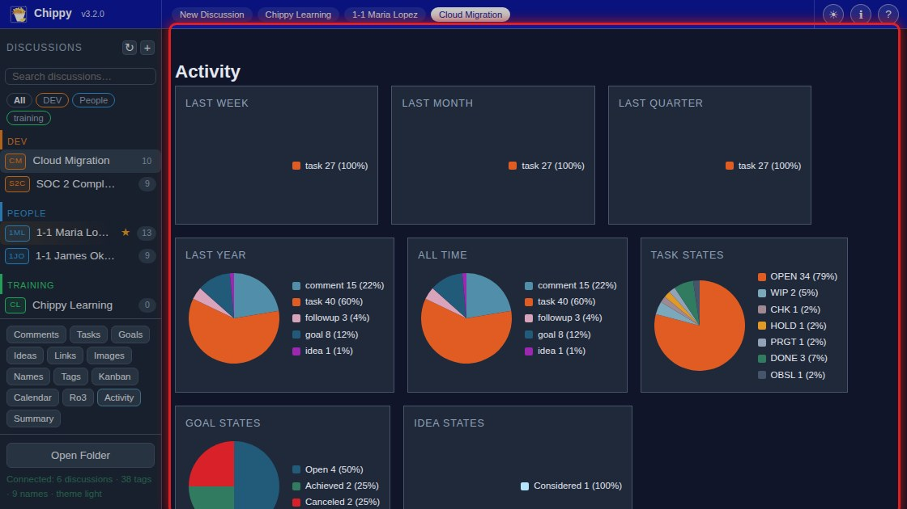

### 2026-08-25 09:11:00 | tags: task, low

35 — The Tags page. Every tag with its total uses and the date it was last used — a quick way to spot neglected topics in your taxonomy.

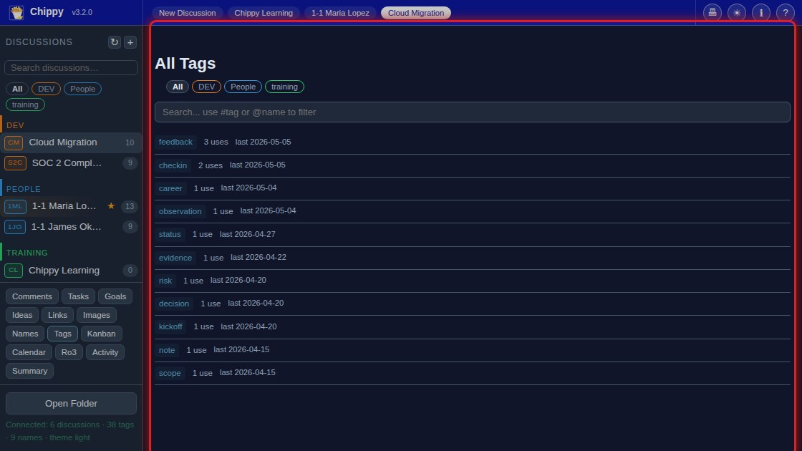

### 2026-08-25 09:12:00 | tags: task, low

34 — The Images page. All pasted images across discussions in one gallery; click one for the carousel with discussion and date captions. Each discussion also has its own gallery at the bottom of its right column.

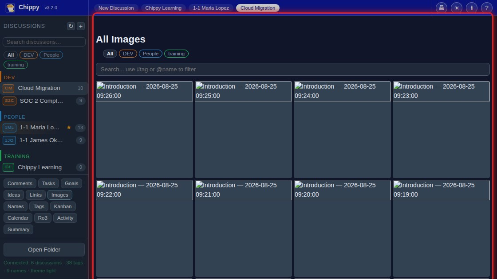

### 2026-08-25 09:13:00 | tags: task, low

33 — The Links page. Every URL you paste is collected here across all discussions, deduplicated and newest first. ✎ renames a link’s label right in the list — the source comment is updated.

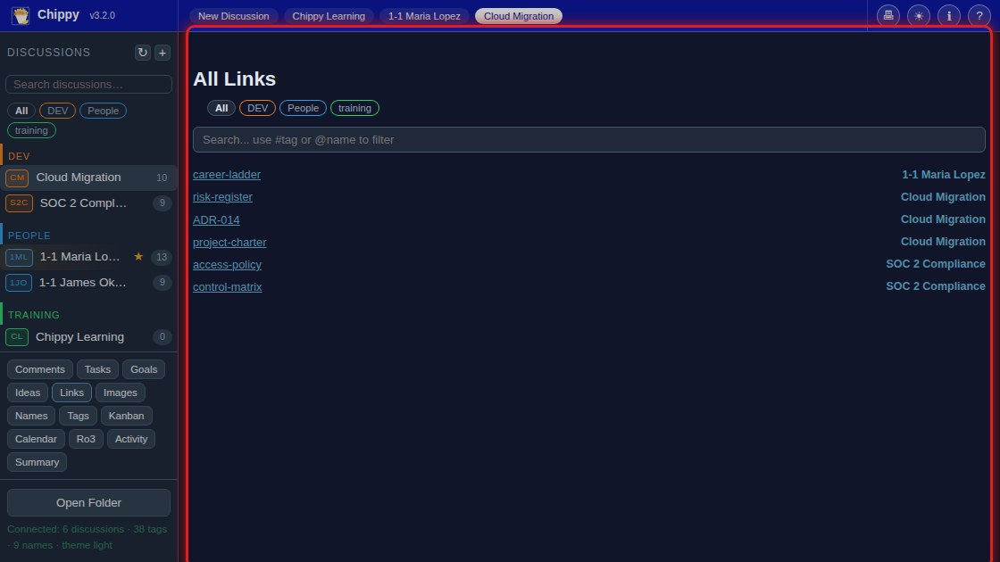

### 2026-08-25 09:14:00 | tags: task, low

32 — Disconnect & broken links. On a linked task card, ✂ disconnects — it removes only this discussion’s link; the task itself stays in its own discussion. If a link’s origin ever disappears, the card renders as a read-only ⚠ stub in the history and leaves the working panels.

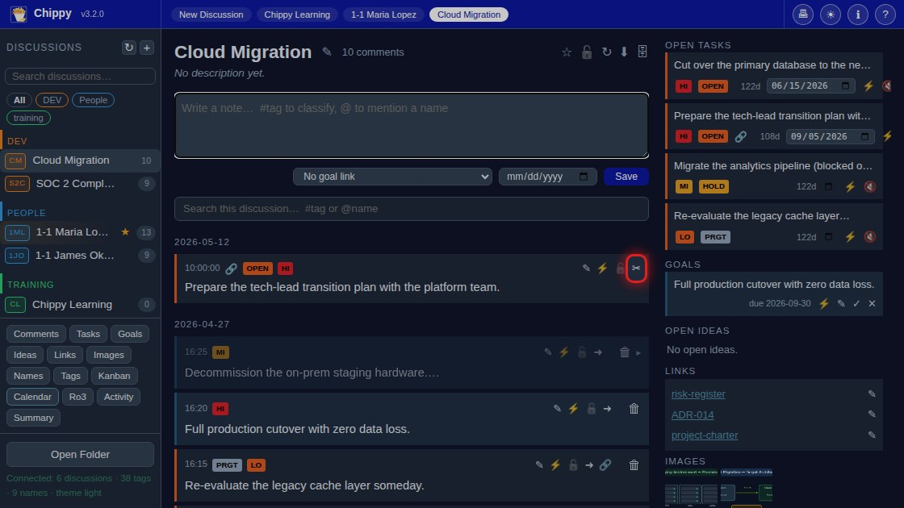

### 2026-08-25 09:15:00 | tags: task, low

31 — Paste images into comments. Ctrl+V pastes any screenshot straight into the comment you’re writing; the file lands in a per-discussion subfolder next to your .md files. Click an image for the full-screen carousel.

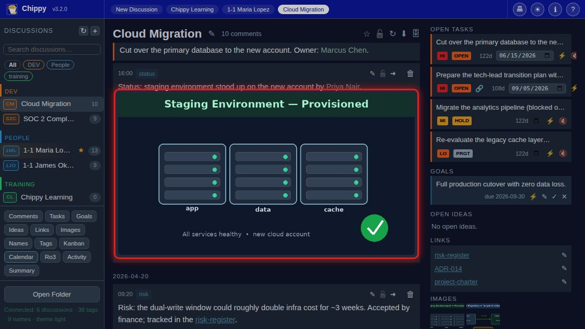

### 2026-08-25 09:16:00 | tags: task, medium

30 — The Names page. Every @[Name] mention is aggregated here: counts, last-seen dates, the discussions each person appears in, and recent excerpts per name. Perfect for "when did I last talk about Maria?"

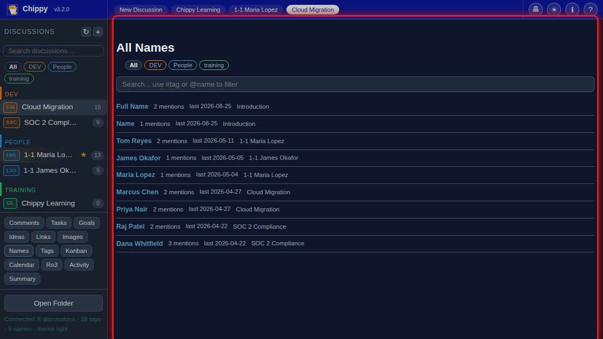

### 2026-08-25 09:17:00 | tags: task, medium

29 — The description area. Each discussion has a free-form Markdown description at the top (✎ to edit): standing context like an agenda, a person’s role and goals, or a project charter — always in view between sessions.

### 2026-08-25 09:18:00 | tags: task, medium

28 — Jump to the source (double-click). On the Comments, Tasks, Goals, Ideas, Ro3 and Calendar pages, double-click any card to jump straight to that comment in its discussion — it flashes briefly so you can’t lose it.

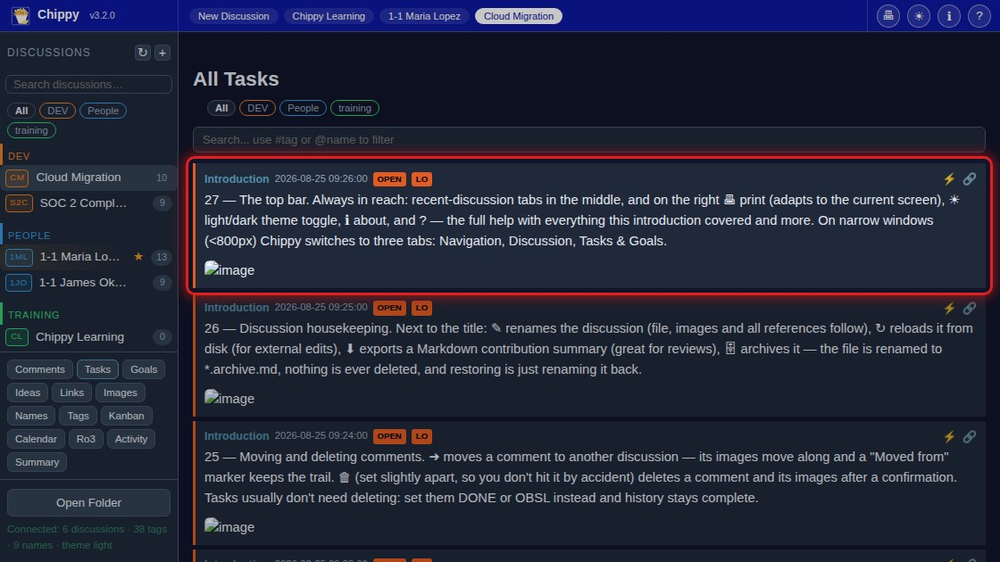

### 2026-08-25 09:19:00 | tags: task, medium

27 — Editing comments. Click ✎ on any comment to edit text and tags in place (add #tags, remove chips with ×; adding #task promotes a comment to a task). Edits on a later day add a single "Updated:" line; action logs and state history are always preserved.

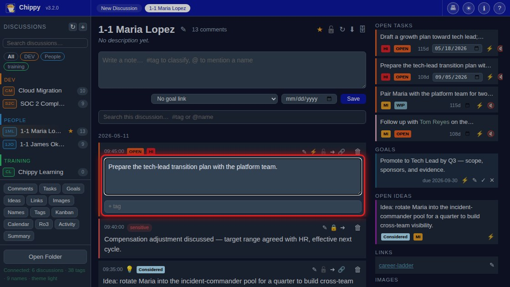

### 2026-08-25 09:20:00 | tags: task, medium

26 — Rule of Three (Ro3). When everything feels important, Ro3 picks three random open tasks across all discussions — a focus set for today. ↻ Refresh re-rolls; muted tasks stay out of the draw.

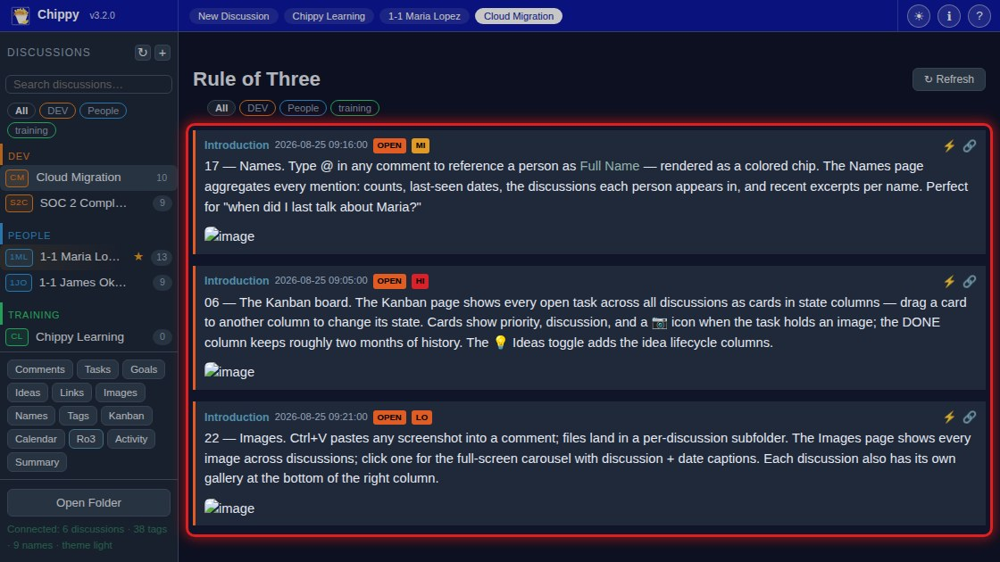

### 2026-08-25 09:21:00 | tags: task, medium

25 — Calendar. The Calendar lays your due tasks out over time — day, focus, work, full and month views. Each card shows state, priority and discussion; click one to open its discussion. The morning "what’s due" scan lives here.

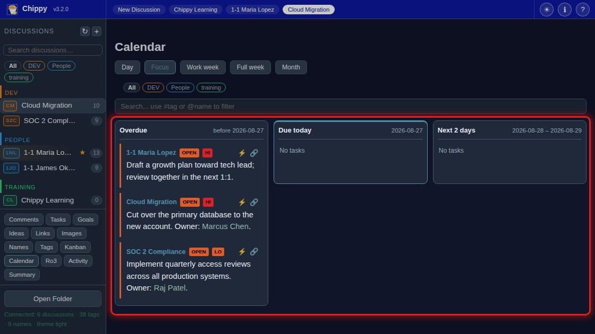

### 2026-08-25 09:22:00 | tags: task, medium

24 — Summary privacy: Remove names. The "Remove names" toggle replaces every name with initials before anything is sent to the API — for use with non-local endpoints. Sensitive-marked comments and discussions are always excluded, toggle or not.

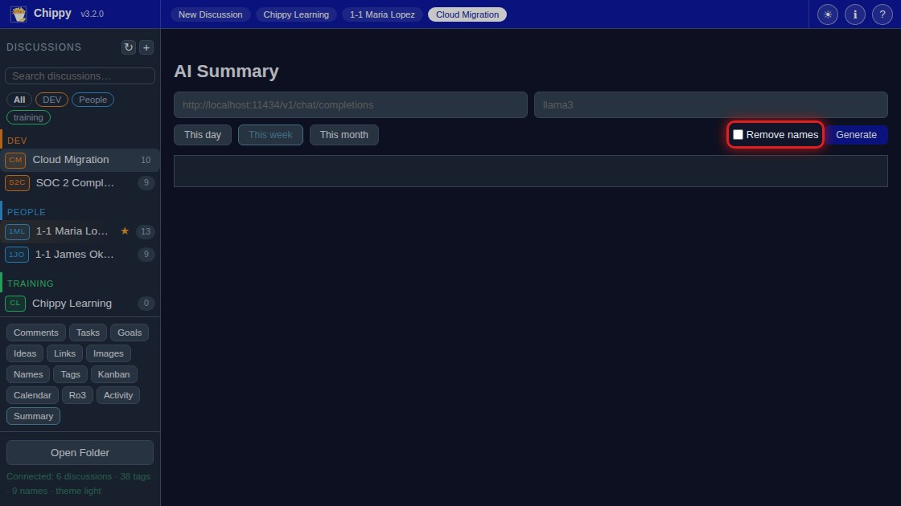

### 2026-08-25 09:23:00 | tags: task, medium

23 — AI Summary. The Summary page condenses your recent comments (day / week / month) into an overall picture plus a per-discussion summary, via a local OpenAI-compatible endpoint you configure. Summaries are kept as editable cards you can move into a discussion.

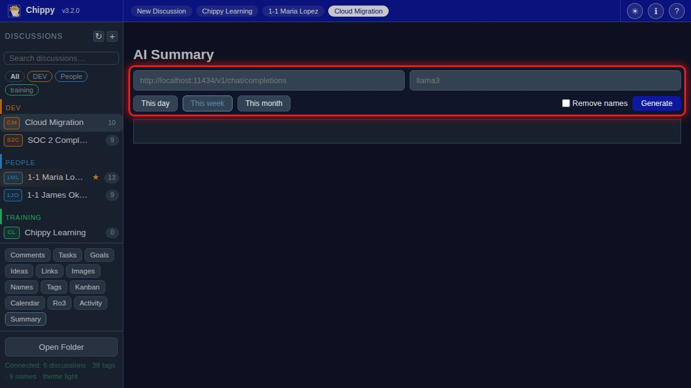

### 2026-08-25 09:24:00 | tags: task, medium

22 — Sensitive discussions. The 🔓 next to the discussion title locks the whole discussion the same way — every comment in it stays out of AI summaries, and a "sensitive" chip appears beside the title.

### 2026-08-25 09:25:00 | tags: task, medium

21 — Sensitive comments. Click the 🔓 on a comment to lock it (🔒): it gets a red "sensitive" chip and a red border and is excluded from AI summaries — it never reaches the LLM. Use it for compensation talks and anything personal.

### 2026-08-25 09:26:00 | tags: task, medium

20 — Unified search. Every list has one search syntax: #tag filters by tag (e.g. #task, #idea:explored), @Name or @[Full Name] filters by mention, anything else is free text — combined with AND. Autocomplete fires on # and @ right in the search box.

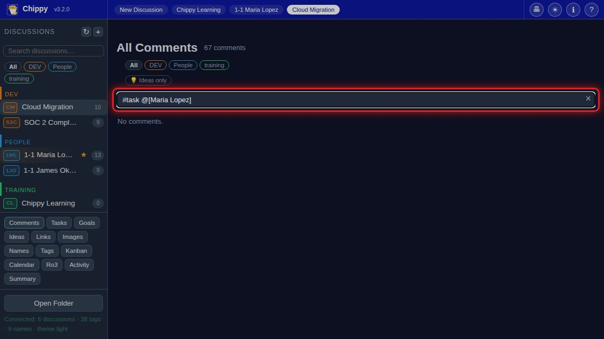

### 2026-08-25 09:27:00 | tags: task, medium

19 — Mute noisy tasks. The 🔇 on a task row hides the task for 5 days — it leaves Ro3 and renders dimmed, then comes back on its own. Muting lives only here on the right-hand task rows, keeping the history stream lean.

### 2026-08-25 09:28:00 | tags: task, medium

18 — Due dates. Give a task a due date in the comment box when creating it, or later via the date field on its task row. Due tasks drive the Calendar page and show their date on every card.

### 2026-08-25 09:29:00 | tags: task, medium

17 — Priorities. Tasks, followups, goals and ideas carry a priority — HI / MI / LO — shown as a colored square; click it to cycle. New items default to low, so promote what matters; priority drives the sort in the task panel and the lists.

### 2026-08-25 09:30:00 | tags: task, medium

16 — Promote an idea. When an idea matures, open its state badge menu and pick "→ Task…" or "→ Goal…": the new entry is created with a prefilled title, the idea is set to Promoted, and both action logs are cross-linked.

### 2026-08-25 09:31:00 | tags: task, medium

15 — Ideas & their lifecycle. Tag a comment #idea (💡) for possibilities that aren’t commitments yet. Ideas move Considered → Explored → Promoted / Shelved via their state badge, and a ▲n indicator counts the interest (actions + links) each idea attracts.

### 2026-08-25 09:32:00 | tags: task, medium

14 — FollowUps. Tag a comment #followup for the lighter cousin of a task — something to raise again rather than work on. Followups share the task state machine and show with their own accent; resolving one closes it just like a task.

### 2026-08-25 09:33:00 | tags: task, medium

13 — Build a goal’s evidence trail. When saving a comment, pick a goal in the dropdown under the input box: the comment is linked to that goal and carries its id. Over months this builds an evidence trail per goal — perfect for promotion cases and reviews.

### 2026-08-25 09:34:00 | tags: task, medium

12 — Goals. Tag a comment #goal to create a goal — highlighted in the history and listed in the right column with ⚡ action, ✎ edit, ✓ achieved and ✕ canceled. Achieving or canceling logs a dated line in Goal Actions.

### 2026-08-25 09:35:00 | tags: task, medium

11 — Mention people with @. Type @ in any comment to reference a person — pick from the autocomplete or create a new name right there. The reference renders as a colored @[Name] chip and feeds the Names page, so you can always find where someone came up.

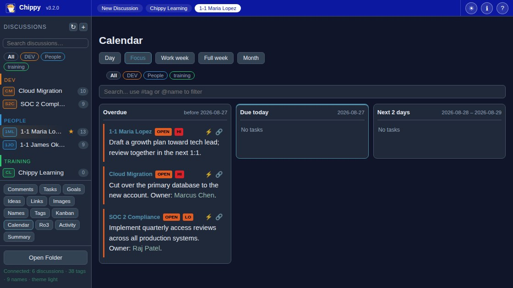

### 2026-08-25 09:36:00 | tags: task, high

10 — Connect a task to other discussions. Some tasks belong to several discussions — a person and a project. Click 🔗 on a task, followup or idea and pick another discussion: it now shows the task live (🔗 badge) at the date you connected it, in its history and its Open Tasks panel. One source of truth — changes made anywhere are saved in the task’s own discussion.

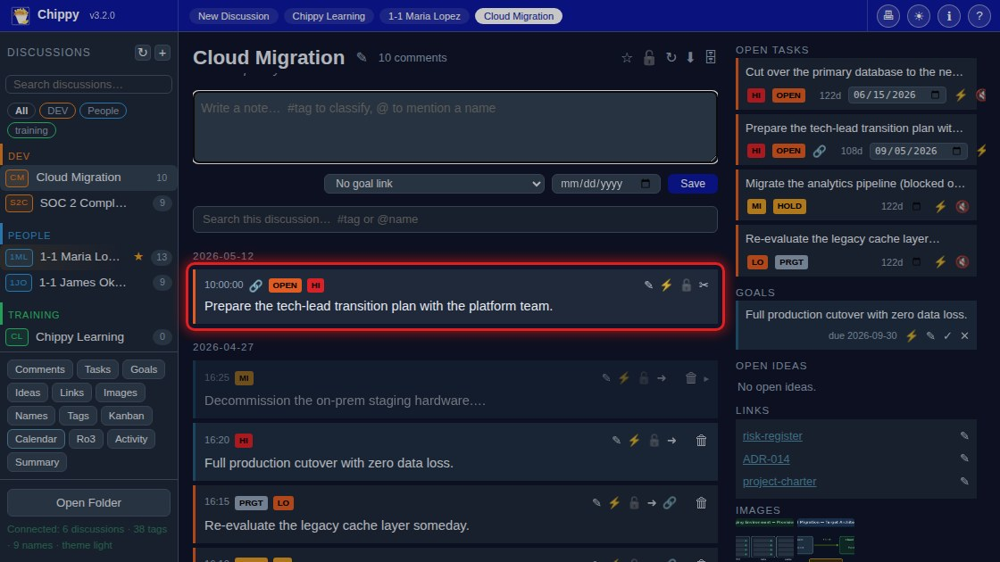

### 2026-08-25 09:37:00 | tags: task, high

09 — The Kanban board. The Kanban page shows every open task across all discussions as cards in state columns — drag a card to another column to change its state. Cards show priority and discussion; the DONE column keeps roughly two months. The 💡 Ideas toggle adds the idea lifecycle columns.

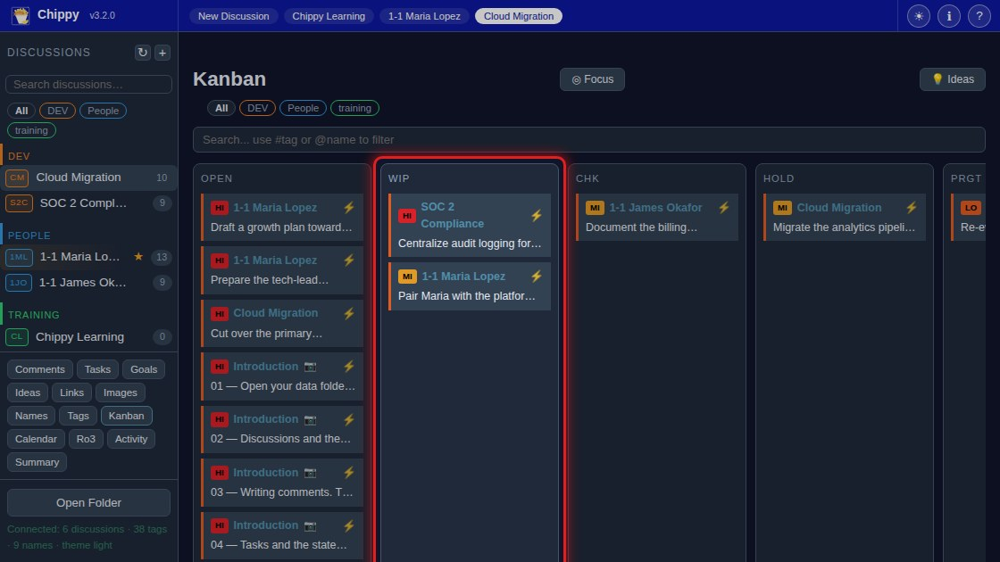

### 2026-08-25 09:38:00 | tags: task, high

08 — The Open Tasks panel. The right column lists this discussion’s open tasks sorted by priority — priority and state squares on the left, age, due date and controls on the right. Double-click a task’s text to jump to its comment in the history.

### 2026-08-25 09:39:00 | tags: task, high

07 — Tasks & the state machine. Tag a comment #task and it gets a state square: OPEN → WIP → CHK → HOLD → PRGT → DONE / OBSL. Click the square for the menu; every transition is logged as a dated "→ STATE" line in the task’s action section. DONE/OBSL tasks collapse in history but are never deleted.

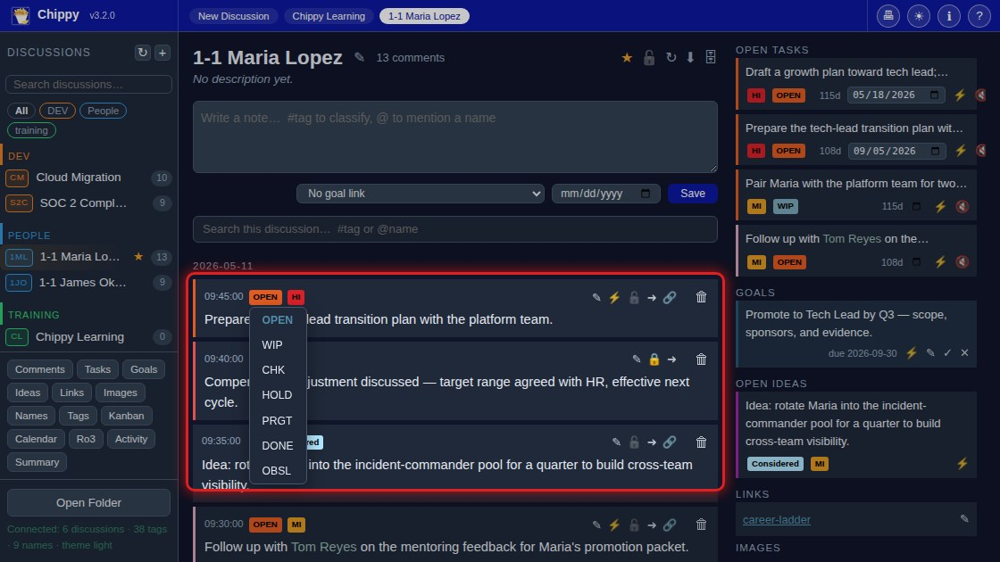

### 2026-08-25 09:40:00 | tags: task, high

06 — Classify comments with #tags. Type #tag anywhere in a comment — the tag jumps out of the text into the chip row and classifies the comment (career, technical, risk, … your taxonomy). Reserved tags do more: #task, #followup, #goal and #idea turn the comment into that item type.

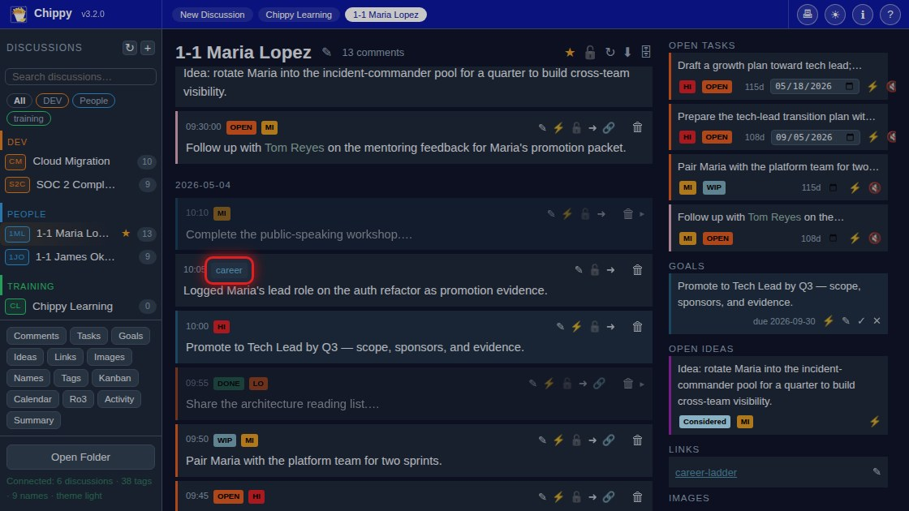

### 2026-08-25 09:41:00 | tags: task, high

05 — Write & save a comment. The input box is the heart of Chippy: type a note and press Save (or Ctrl+Enter). Comments support Markdown — headings, bold, lists, code, quotes. Drafts auto-save, so you can switch discussions mid-thought and your text is still there when you come back.

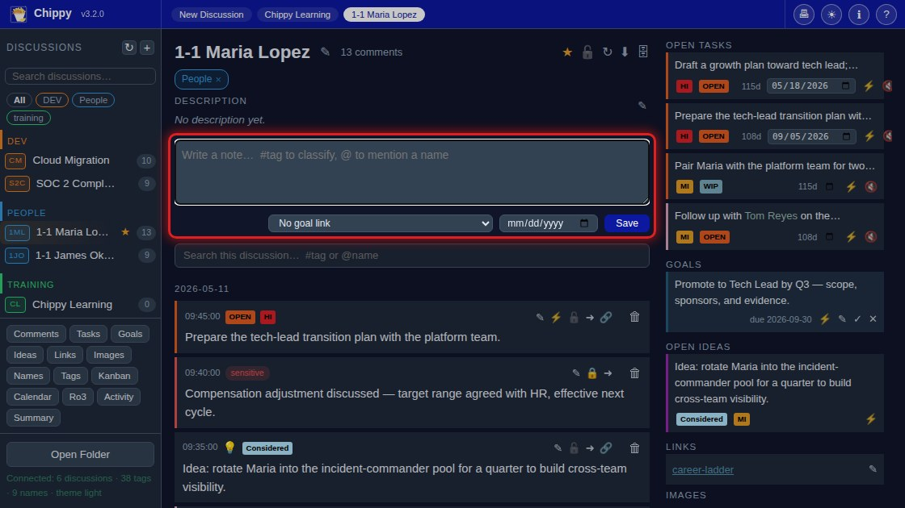

### 2026-08-25 09:42:00 | tags: task, high

04 — The sidebar: groups, favorites & filters. Discussions are grouped under colored headers by their tag; favorites (★) are pinned on top and each row shows its comment count. The colored buttons above the list filter to one group, and the search box filters by name as you type.

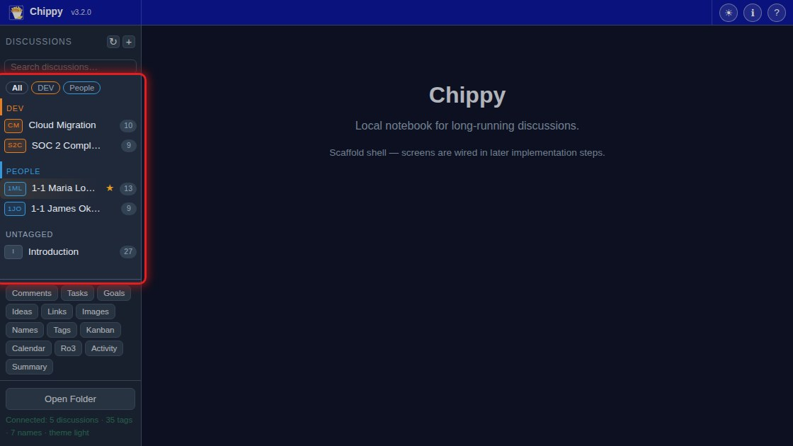

### 2026-08-25 09:43:00 | tags: task, high

03 — Name and tag your discussion. A new discussion is born as "New Discussion" — click the ✎ next to the title and give it its real name, here "Chippy Learning". The tag editor beneath the title files it into a sidebar group: type "training" and it appears under that colored header. This discussion is our playground — you’ll see it in the sidebar of every following screenshot, and you can repeat each exercise inside it.

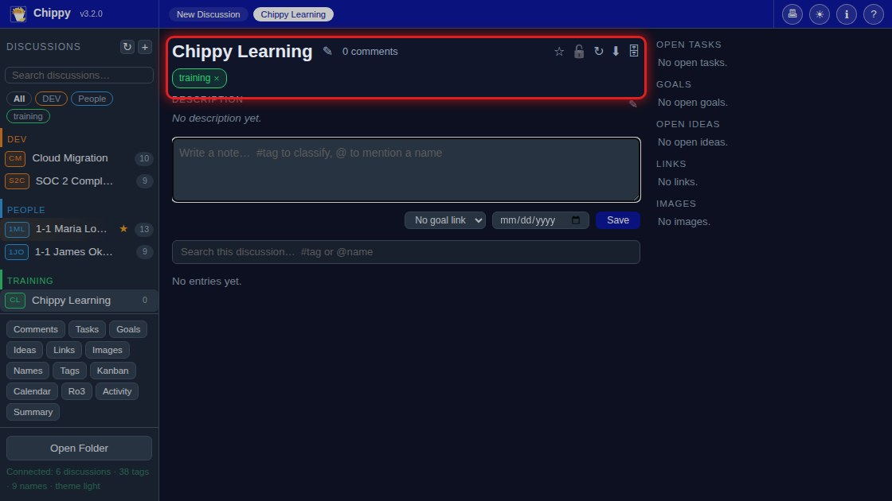

### 2026-08-25 09:44:00 | tags: task, high

02 — Create a discussion. A discussion is one .md file for a person, a project, a meeting series — any long-running topic. Click the + next to "Discussions" to create one; it opens immediately so you can rename it and start writing.

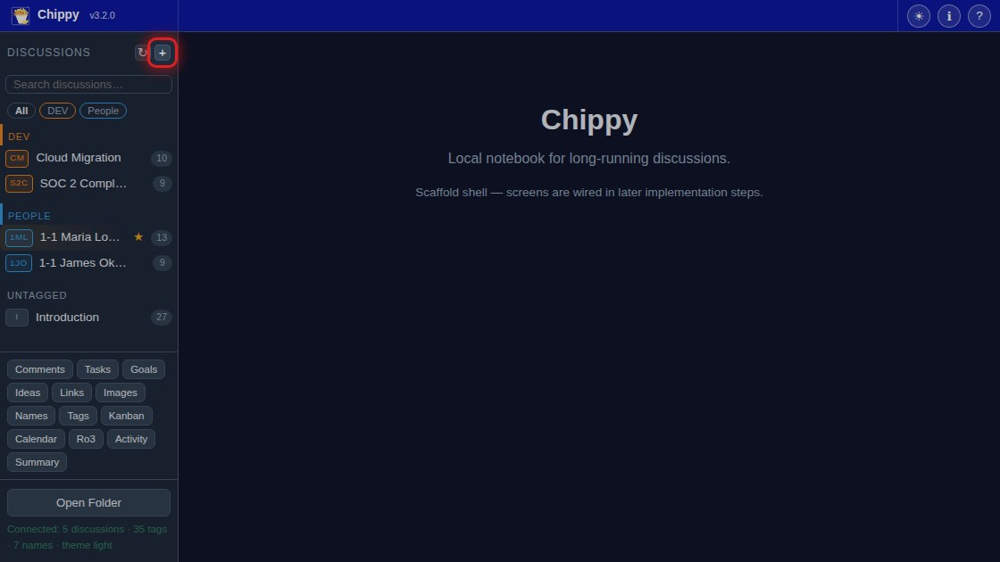

### 2026-08-25 09:45:00 | tags: task, high

01 — Open your data folder. Chippy stores everything as plain Markdown files in one folder you choose — no database, no cloud. Click "Open Folder" at the bottom of the sidebar and pick (or create) a folder; the status line shows the connected counts. Tip: a synced folder (e.g. OneDrive) makes the notebook portable.

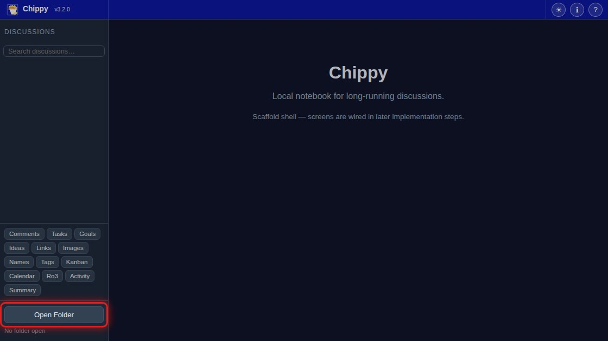

