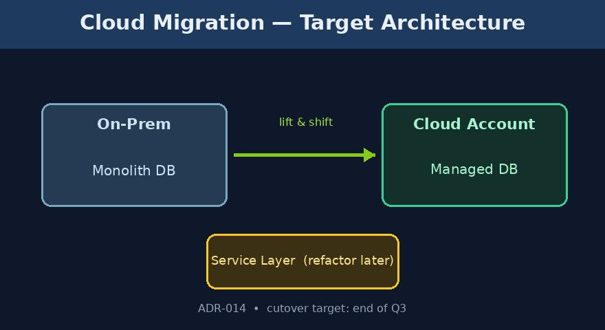
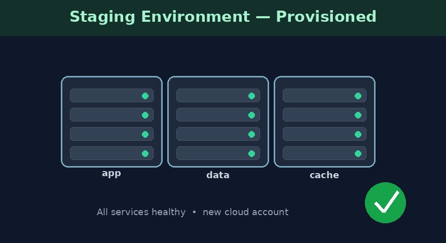

# Cloud Migration

## Preparation

## Entries

### 2026-04-20 09:00 | tags: kickoff

Kickoff: migrate the monolith's data services to the new cloud account. Target cutover end of Q3. Program lead: @[Priya Nair]. Charter: [project-charter](https://intra.example.com/cloud/charter).

### 2026-04-20 09:10 | tags: decision

Decision: lift-and-shift the database first (owner @[Marcus Chen]), refactor the service layer after. Rollback plan in [ADR-014](https://intra.example.com/adr/014).

### 2026-04-20 09:20 | tags: risk

Risk: the dual-write window could roughly double infra cost for ~3 weeks. Accepted by finance; tracked in the [risk-register](https://intra.example.com/cloud/risks).

### 2026-04-27 16:00 | tags: status

Status: staging environment stood up on the new account by @[Priya Nair].

### 2026-04-27 16:05 | tags: task, high | due: 2026-06-15

Cut over the primary database to the new account. Owner: @[Marcus Chen].

### 2026-04-27 16:10 | tags: task, onholdtask, medium

Migrate the analytics pipeline (blocked on vendor access).

### 2026-04-27 16:15 | tags: task, purgatorytask, low

Re-evaluate the legacy cache layer someday.

### 2026-04-27 16:20 | tags: goal, goal-cm501, high | due: 2026-09-30

Full production cutover with zero data loss.

### 2026-04-27 16:25 | tags: goal, goal-cm602, medium, achievedgoal

Decommission the on-prem staging hardware.

Achieved: 2026-05-10 11:00:00

