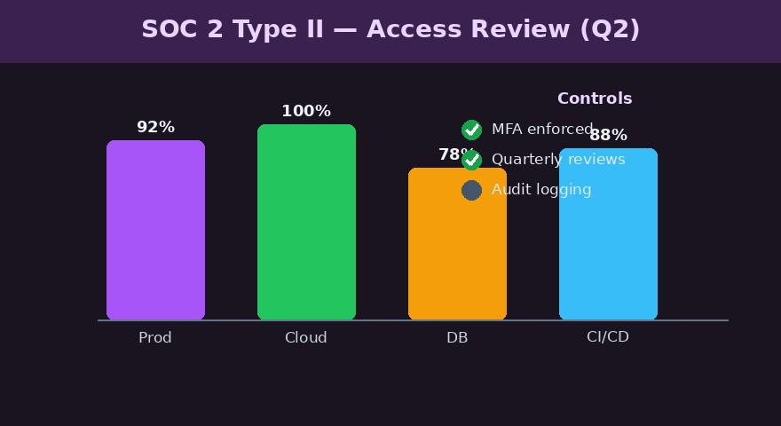

# SOC 2 Compliance

## Preparation

## Entries

### 2026-04-15 13:00 | tags: scope

Scope set for SOC 2 Type II: access control, change management, monitoring. Auditor: @[Dana Whitfield]; internal lead: @[Raj Patel]. Control matrix: [control-matrix](https://intra.example.com/soc2/controls).

### 2026-04-15 13:10 | tags: feedback

Auditor feedback from @[Dana Whitfield]: tighten the access-review cadence to quarterly. Policy: [access-policy](https://intra.example.com/soc2/access-policy).

### 2026-04-15 13:20 | tags: note, muted:2026-06-01

Parking: vendor risk assessments — revisit after the access-control work lands.

### 2026-04-22 09:30 | tags: evidence

Evidence: Q2 access-review dashboard exported for the auditor @[Dana Whitfield].

### 2026-04-22 10:00 | tags: task, low | due: 2026-07-01

Implement quarterly access reviews across all production systems. Owner: @[Raj Patel].

### 2026-04-22 10:05 | tags: task, inprogresstask, high

Centralize audit logging for change management.

### 2026-04-22 10:10 | tags: task, resolvedtask, medium

Enable MFA enforcement org-wide.

Resolved: 2026-05-02 15:30:00

Task Resolution Actions
- 2026-05-02 : Enforced MFA via the IdP policy; verified 100% coverage in the access report.

### 2026-04-22 10:15 | tags: goal, goal-sc701, high | due: 2026-10-31

Achieve a SOC 2 Type II report with no exceptions.

### 2026-04-22 10:20 | tags: goal, goal-sc802, low, canceledgoal

Pursue ISO 27001 in parallel.

Canceled: 2026-05-12 09:00:00

